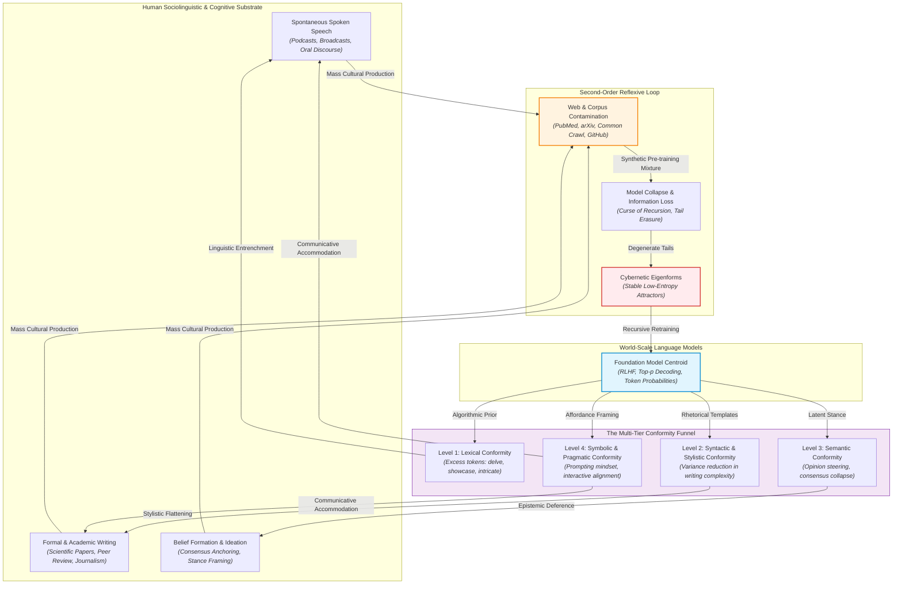

# Second-Order Cybernetics & Language Model Conformity (SOC-LMC)

[](LICENSE)
[](pyproject.toml)
[](corpus/taxonomy.yaml)
[](corpus/INDEX.md)

> An open-source research archive, formal taxonomy, and computational indexing system investigating **Second-Order Cybernetics**, **recursive human-machine coupling**, and the **empirical impacts of conformity** arising from civilizational interaction with world-scale Large Language Models (LLMs).

---

## 1. Epistemological Manifesto: From First-Order to Second-Order AI

Mainstream Artificial Intelligence alignment research has historically treated alignment as an engineering problem in **First-Order Cybernetics** (Norbert Wiener, W. Ross Ashby)—the cybernetics of *observed systems*. In this paradigm:
- The language model is an external, bounded computational object.
- The human researcher/user is an external observer who defines objective functions or steers outputs via prompt engineering and Reinforcement Learning from Human Feedback (RLHF).
- The human communicative baseline is assumed to be an invariant, pristine external ground truth.

```
FIRST-ORDER CYBERNETIC CONTROL (OBSERVED SYSTEM)
┌────────────────┐      Steering / Feedback       ┌────────────────────────┐
│ Human Observer ├───────────────────────────────►│  Bounded Model Engine  │
│  (Static Prior)│◄───────────────────────────────┤   (Target of Control)  │
└────────────────┘       Generated Output         └────────────────────────┘
```

When Large Language Models scale to hundreds of millions of daily conversational agents, rewrite scientific abstracts, generate educational materials, and mediate interpersonal writing, **this first-order separation breaks down**.

The human observer is **inside the system**. 

The dynamic is governed by **Second-Order Cybernetics** (Heinz von Foerster, Margaret Mead, Gregory Bateson, Humberto Maturana, and Francisco Varela)—the cybernetics of *observing systems*. We are witnessing a recursive, closed-loop autopoietic system where:
1. The machine learns statistical patterns from human culture.
2. The machine introduces sampling distortions, RLHF reward-model artifacts, and modal centroid biases.
3. Humans interact with the machine, subconsciously accommodate its affordances, and internalize its patterns.
4. Human spoken and written production converges on machine attractors—reducing human expressive and conceptual variance.
5. The resulting homogenized human output floods the public sphere, poisoning future pre-training distributions and completing an **autophagous loop**.



---

## 2. Taxonomy of AI-Induced Conformity

We formalize conformity across five interconnected operational tiers. Detailed mathematical formalisms and metric definitions are documented in [docs/TAXONOMY.md](docs/TAXONOMY.md).

| Tier | Stratum | Observable Empirical Phenomenon | Key Empirical Indicators |
| :--- | :--- | :--- | :--- |
| **L1** | **Lexical Conformity** | Word-choice entrenchment; anomalous adoption of model signature vocabulary into spontaneous human production. | Excess Word Frequency ($Z$-score $> 4.0$), Vocabulary size contraction, Cross-modal speech entrenchment. |
| **L2** | **Syntactic & Stylistic Conformity** | Compression of rhetorical variance; flattening of sentence structures, parse tree depths, and authorial rhythm. | 21%–50% contraction in complexity variance ($\Delta \text{Var}$), Loss of stylistic entropy ($H_{\text{style}}$). |
| **L3** | **Semantic & Ideational Conformity** | Convergence of opinions and problem-solving strategies; consensus anchoring toward model RLHF centroids. | Semantic Volume collapse ($V_{\text{semantic}} \to 0$), Latent opinion drift ($\Delta \theta$), Suppression of heterodox hypotheses. |
| **L4** | **Symbolic & Pragmatic Conformity** | Adaptation of communicative intent and mental models to machine affordances; instrumentalized discourse. | Elevated Language Style Matching (LSM), Interpersonal turn-taking simplification, Prompting mindsets. |
| **L5** | **Systemic / Reflexive Loops** | Autophagous data cycles where AI-conditioned human text trains future foundation models. | Model Collapse, Tail probability erasure ($\mathcal{D}_{KL}(P_0 \parallel P_k) \to \infty$), Monocultural eigenforms. |

---

## 3. Foundational Literature & Seed Corpus Highlights

The repository maintains an automated, curated collection of empirical and theoretical papers in [`corpus/papers/`](corpus/papers/), cataloged in [`corpus/INDEX.md`](corpus/INDEX.md).

### Landmark Empirical Case Studies

1. **Spoken Discourse & Active Vocabulary Entrenchment**  
   *Empirical evidence of Large Language Model's influence on human spoken communication*  
   **Authors**: Hiromu Yakura, Ezequiel Lopez-Lopez, Levin Brinkmann, Iyad Rahwan, et al. (Max Planck Institute / Center for Humans and Machines, 2024)  
   **Dossier**: [`corpus/papers/2409.01754.md`](corpus/papers/2409.01754.md) | [arXiv:2409.01754](https://arxiv.org/abs/2409.01754)  
   *Core Finding*: Synthetic-control analysis of **737,083 hours of spontaneous speech across 824,634 podcast episodes** proves that words preferentially produced by ChatGPT (*delve*, *showcase*, *boast*, *intricacies*, *meticulous*) spiked abruptly in spontaneous human speech post-release. Controlled laboratory experiments ($N = 496$) demonstrate that brief chatbot interactions entrench these tokens into active human vocabulary, persisting across cognitive distractor tasks.

2. **Scientific Literature & Excess Vocabulary at Scale**  
   *Delving into ChatGPT usage in academic writing through excess vocabulary*  
   **Authors**: Dmitry Kobak, Rita González-Márquez, Emőke-Ágnes Horvát, Jan Lause (2024)  
   **Dossier**: [`corpus/papers/2406.07016.md`](corpus/papers/2406.07016.md) | [arXiv:2406.07016](https://arxiv.org/abs/2406.07016)  
   *Core Finding*: Analysis of **14+ million PubMed scientific abstracts** reveals that at least 10%–13.5% of biomedical abstracts in 2024 were processed by LLMs, with word frequencies for *delves* surging by over 2,500%—a structural transformation exceeding any historical event in academic literature.

3. **Evaluation Discourse & The Reflexive Peer Review Loop**  
   *Monitoring AI-Modified Content at Scale: A Case Study on the Impact of ChatGPT on AI Conference Peer Reviews*  
   **Authors**: Weixin Liang, Zachary Izzo, James Y. Zou, et al. (Stanford University, ICML 2024)  
   **Dossier**: [`corpus/papers/2403.07183.md`](corpus/papers/2403.07183.md) | [arXiv:2403.07183](https://arxiv.org/abs/2403.07183)  
   *Core Finding*: Generalized Maximum Likelihood estimation estimates that 6.5% to 16.9% of peer reviews across NeurIPS, ICLR, CoRL, and EMNLP were substantially modified by LLMs, converging on formulaic adjectives (*commendable*, *meticulous*, *intricate*) and generic critique profiles.

4. **The Mathematical Limit of Autophagous Loops**  
   *The Curse of Recursion: Training on Generated Data Makes Models Forget*  
   **Authors**: Ilia Shumailov, Zakhar Shumaylov, Yarin Gal, Ross Anderson, et al. (Nature 631, 2024)  
   **Dossier**: [`corpus/papers/2305.17493.md`](corpus/papers/2305.17493.md) | [arXiv:2305.17493](https://arxiv.org/abs/2305.17493)  
   *Core Finding*: Mathematical proof and empirical verification that recursive training on synthetic distributions causes catastrophic **Model Collapse**: statistical, functional, and expressive errors compound, causing distributional tails to disappear and the system to collapse into a low-entropy attractor eigenform.

5. **Latent Opinion Steering & Semantic Alignment**  
   *Co-Writing with Opinionated Language Models Affects Users' Views*  
   **Authors**: Maurice Jakesch, Advait Bhat, Daniel Buschek, Lillian Lee, Mor Naaman (CHI 2023)  
   **Dossier**: [`corpus/papers/2303.08974.md`](corpus/papers/2303.08974.md) | [arXiv:2303.08974](https://arxiv.org/abs/2303.08974)  
   *Core Finding*: In a controlled experiment ($N = 1,506$), users co-writing with subtly biased LLMs significantly shifted their personal attitudes without conscious awareness, demonstrating latent persuasion through effortless cognitive offloading.

---

## 4. Repository Structure

```
.
├── README.md                      # Foundational manifesto, taxonomy, and system architecture
├── LICENSE                        # MIT License
├── pyproject.toml                 # Package configuration (Python 3.10+)
├── config/
│   └── queries.yaml               # Query recipes, arXiv categories, and taxonomy keywords
├── corpus/
│   ├── INDEX.md                   # Chronological and thematic master catalog
│   ├── catalog.json               # Machine-readable metadata repository
│   ├── bibliography.bib           # Consolidated BibTeX database
│   ├── taxonomy.yaml              # Formal ontology (dimensions, metrics, substrates)
│   └── papers/                    # Structured Markdown dossiers for each paper
│       ├── 2409.01754.md          # Yakura, Brinkmann et al. (Spoken discourse lexical shift)
│       ├── 2406.07016.md          # Kobak et al. (PubMed excess vocabulary)
│       ├── 2406.17324.md          # Astarita & Kruk (Scientific publications in Astronomy)
│       ├── 2403.07183.md          # Liang et al. (Peer review AI modification)
│       ├── 2305.17493.md          # Shumailov et al. (Model Collapse / Curse of Recursion)
│       └── 2303.08974.md          # Jakesch et al. (Co-writing opinion steering)
├── docs/
│   ├── THEORY.md                  # Treatise on Second-Order Cybernetics applied to Foundation Models
│   ├── TAXONOMY.md                # Quantitative metrics, formalisms, and empirical indicators
│   └── CONTRIBUTING.md            # Guidelines for manual curation and harvesting tools
└── tools/
    ├── __init__.py
    ├── arxiv_harvester.py         # Rate-limited arXiv API client, classifier, and dossier generator
    └── generate_index.py          # Master index compiler and statistics engine
```

---

## 5. Automated arXiv Harvester & Ingestion Engine

The repository includes a standalone, zero-dependency CLI tool ([`tools/arxiv_harvester.py`](tools/arxiv_harvester.py)) built on the Python standard library. It handles rate limiting ($\ge 3.0$s), parses arXiv Atom XML feeds, classifies papers against the SOC-LMC taxonomy, formats Markdown dossiers with YAML frontmatter, and synchronizes the catalog.

### Quickstart

#### Ingest a specific paper by arXiv ID
```bash
python3 tools/arxiv_harvester.py fetch --id 2409.01754
```
*Output*: Generates `corpus/papers/2409.01754.md`, extracts BibTeX, assigns conformity tags, and rebuilds `corpus/INDEX.md` and `corpus/catalog.json`.

#### Search arXiv for literature
```bash
# Search using custom Boolean queries across cs.CL, cs.CY, cs.AI, cs.HC
python3 tools/arxiv_harvester.py search --query 'ti:"excess vocabulary" OR abs:"linguistic homogenization"' --max-results 5

# Automatically ingest and catalog all search results
python3 tools/arxiv_harvester.py search --query 'ti:"model collapse" AND abs:"feedback loop"' --max-results 3 --ingest
```

#### Rebuild Master Index and Statistics
```bash
python3 tools/generate_index.py
```

---

## 6. Second-Order Cybernetic Theoretical Matrix

| Cybernetic Theorist | Foundational Construct | Application to World-Scale Language Models |
| :--- | :--- | :--- |
| **Heinz von Foerster** | *Observing Systems & Circular Causality* | The human observer cannot evaluate model alignment from an external vantage; human preferences are continually conditioned by model outputs. |
| **Heinz von Foerster** | *Eigenforms ($\mathcal{F}(\Omega) = \Omega$)* | Homogenized language templates and modal opinions represent stable attractors of recursive human-machine interaction. |
| **Maturana & Varela** | *Structural Coupling & Consensual Domains* | Humans and LLMs undergo mutual plastic adaptation; human languaging accommodates machine affordances, eroding idiosyncratic idioms. |
| **Gregory Bateson** | *Epistemological Traps & Ecology of Mind* | The delusion that humans can deploy AI as a neutral cognitive prosthesis without altering their own cognitive ecology. |
| **Gordon Pask** | *Conversation Theory & Closure* | Dialogue reaches premature conceptual closure when the conversational partner is an optimization engine maximizing token probabilities. |
| **Shumailov et al.** | *Autophagous Loops & Model Collapse* | Mathematical decay of informational entropy when generative models consume their own synthetically mediated culture. |

For an extended theoretical exposition, consult [docs/THEORY.md](docs/THEORY.md).

---

## 7. Contributing & Research Collaboration

We actively invite additions of empirical studies, theoretical papers, and analytical scripts:
- Review [docs/CONTRIBUTING.md](docs/CONTRIBUTING.md) for dossier formatting conventions.
- Submit pull requests adding paper dossiers to `corpus/papers/`.
- Propose new arXiv search strategies in `config/queries.yaml`.

---

## 8. Citation

If you use this research archive, taxonomy, or harvesting engine in your work, please cite:

```bibtex
@misc{soc_lmc_archive_2024,
  title={Second-Order Cybernetics and Language Model Conformity: An Open Research Archive and Taxonomy},
  author={{SOC-LMC Contributors}},
  year={2024},
  howpublished={\url{https://github.com/LJPearson176/Empirical-Conformity}},
  note={Computational repository and empirical literature index}
}
```
